# FluxCap

*"Nom de Zeus Marty, c'est le Flux Capacitor des idées et des actions !"*

## L'origine du projet

Chaque jour, un même constat face au Flux : cette marée faite d'articles de veille à lire, d'idées de projets spontanées, de notes volantes et de tâches urgentes. Ce flux est un carburant, mais sans structure, il finit par submerger.

FluxCap est né d'un besoin simple : ne pas bloquer ce Flux, mais lui imposer un Cap.

### La mécanique : trois flux, une mire

À l'image du célèbre convecteur temporel de Retour vers le futur, l'application fonctionne comme un point de convergence de trois faisceaux distincts pour n'en former qu'un seul, orienté vers l'avenir :

1. **Le flux des connaissances** (la veille) : capturer l'information pertinente sans la laisser se perdre.
2. **Le flux de la pensée** (les notes) : poser les idées à chaud, dans un espace épuré, pour libérer la charge mentale.
3. **La ligne de mire** (les tâches) : le cap, le point de convergence où les tâches en cours, la veille et les notes peuvent se transformer en actions concrètes et planifiées.


### La philosophie

FluxCap écarte les usines à gaz et les processus rigides pour se concentrer sur la maîtrise de l'attention. En reliant directement ce qui est appris à ce qui doit être fait, l'application élimine la friction. Libéré des onglets accumulés et des listes de tâches déconnectées de la réalité, chacun peut tracer sa propre trajectoire. Organiser le présent permet de propulser, sereinement, son "moi du futur".

## En pratique

Application personnelle de gestion des tâches, des notes et de la veille, en deux contextes séparés **Pro / Perso** (chacun son rythme, ses notifications email d'ouverture/clôture, son mode congés) :

- **Aujourd'hui** — sélection quotidienne limitée à 3-4 tâches (score priorité × urgence, épinglage, report remonté, alerte anti-oubli après 7 jours d'inactivité), sous-tâches et jalons, historique de report.
- **Clôture** — décision obligatoire en fin de journée sur chaque tâche du jour (réalisée / reportée / abandonnée), sans compteur de "streak" culpabilisant.
- **Veille** — flux RSS/Atom groupés par domaine, collecte automatique planifiée, trois actions par article (ignorer / garder pour lecture / transformer en tâche).
- **Notes** — vue à deux volets, éditeur markdown, pièces jointes, fusion de plusieurs notes en une seule ou en tâche, capture externe sans ouvrir l'app (raccourci Apple Shortcuts ou favori Chrome — voir [raccourci-partage.md](./raccourci-partage.md)).
- **Domaines** — tags entièrement libres et gérables depuis l'app, distincts pour les tâches et pour la veille.
- **Tableau de bord** — vue d'ensemble des tâches actives par domaine et par priorité.
- **Pomodoro** intégré sur les tâches administratives (durée réglable).
- **Sécurité** — mot de passe et/ou clé d'accès WebAuthn (Face ID/Touch ID), révocation des sessions, clé API dédiée pour les intégrations externes.
- **Widget** des tâches en cours sur iPhone (Scriptable) et Mac (xbar) — voir [widget-taches.md](./widget-taches.md).
- PWA installable, thème clair/sombre.

Voir [spec-fluxcap.md](./spec-fluxcap.md) pour le détail complet de chaque fonctionnalité et son état d'implémentation.

## Captures

<p><b>Onglet "Aujourd'hui"</b><br/>
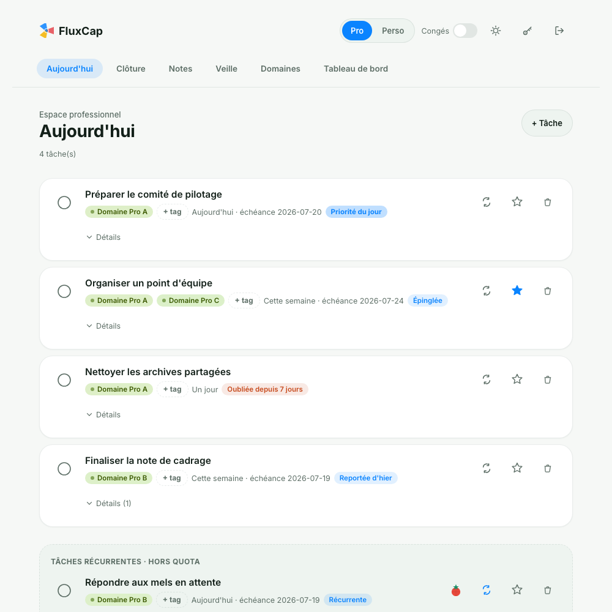</p>

<p><b>Onglet "Clôture"</b><br/>
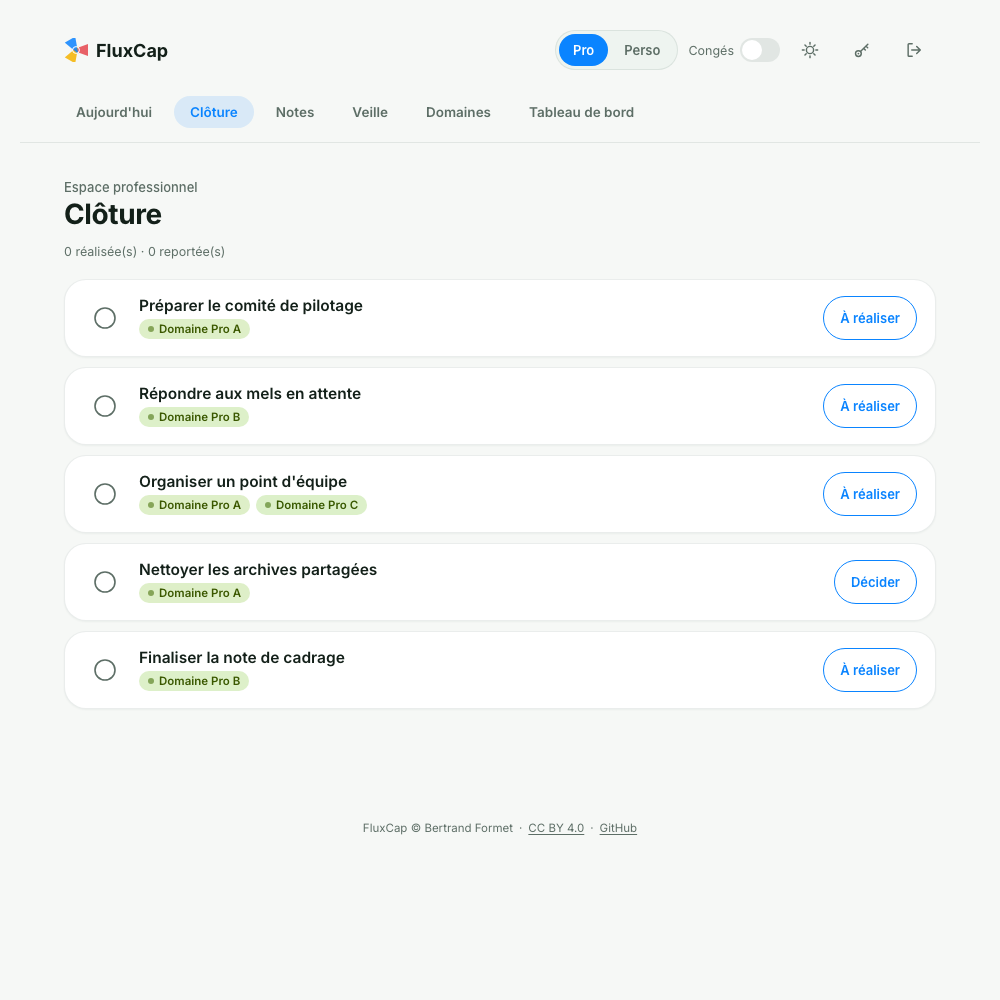</p>

<p><b>Onglet "Notes"</b><br/>
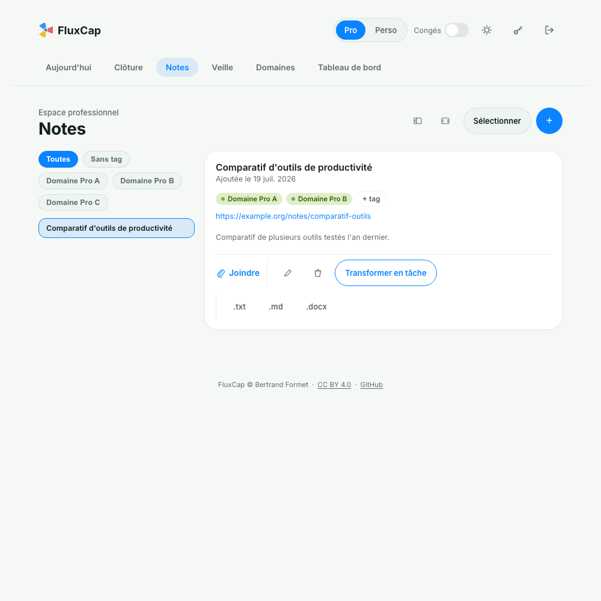</p>

<p><b>Onglet "Veille"</b><br/>
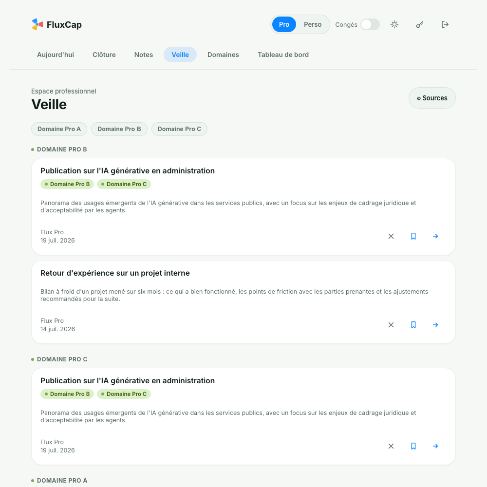</p>

<p><b>Onglet "Domaines"</b><br/>
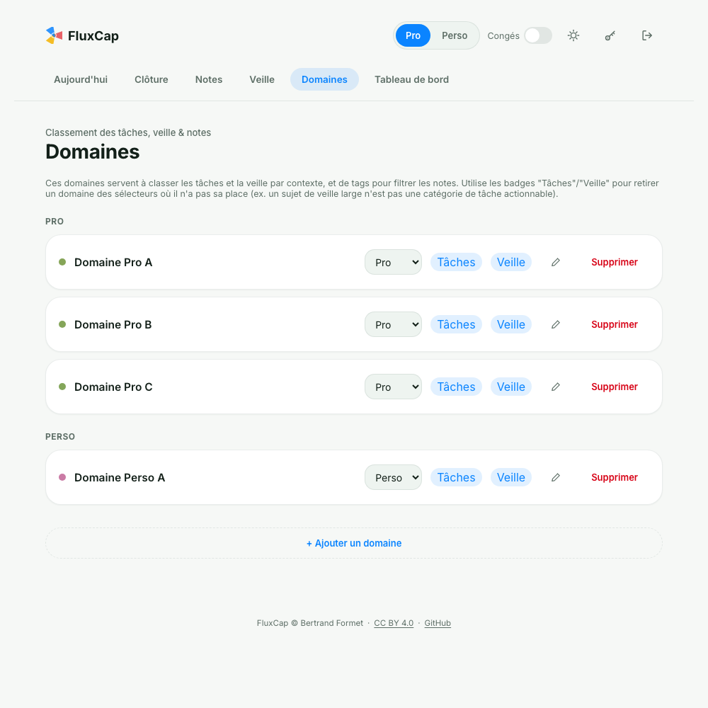</p>

<p><b>Onglet "Tableau de bord"</b><br/>
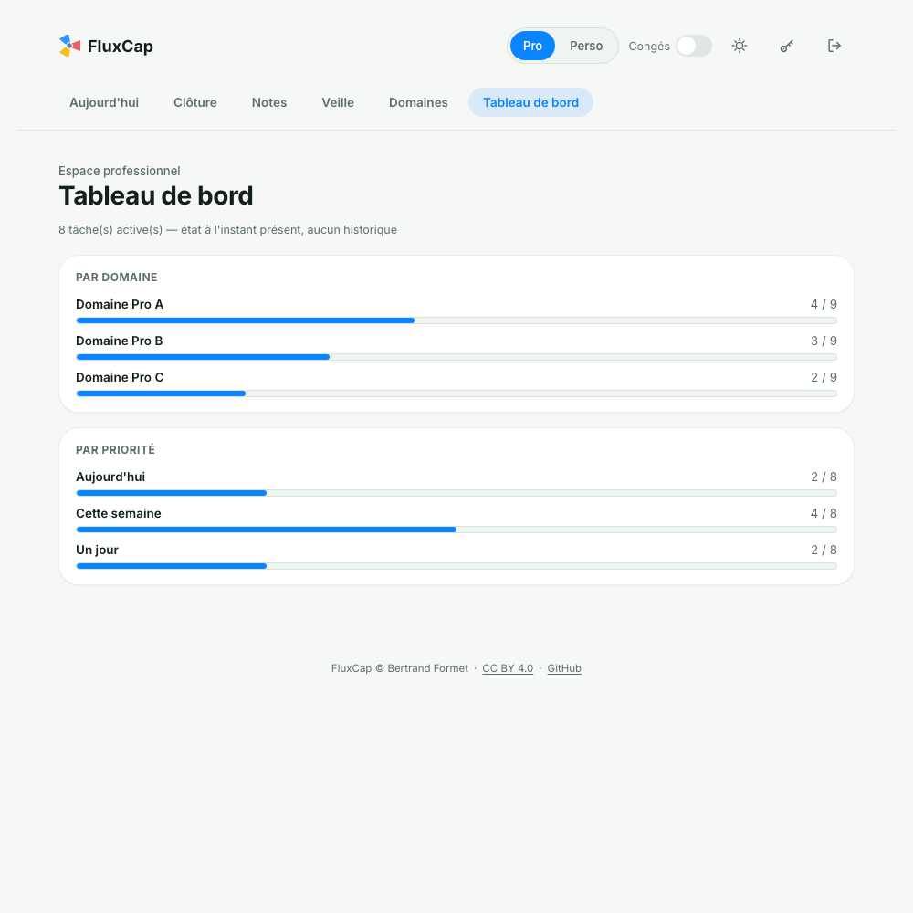</p>

<p><b>Première ouverture de l'application</b><br/>

</p>

<p><b>Sécurité</b><br/>
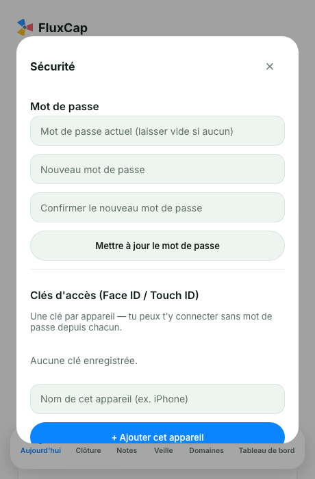
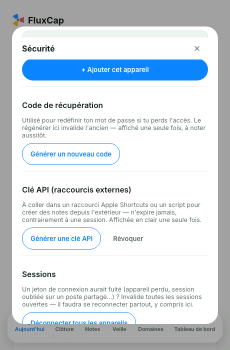</p>

<p><b>Ajout d'une tâche</b><br/>
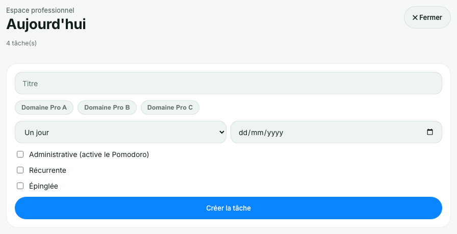</p>

<p><b>Ajout d'une sous-tâche</b><br/>
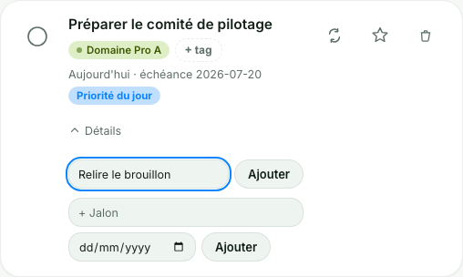</p>

<p><b>Ajout d'une note</b><br/>
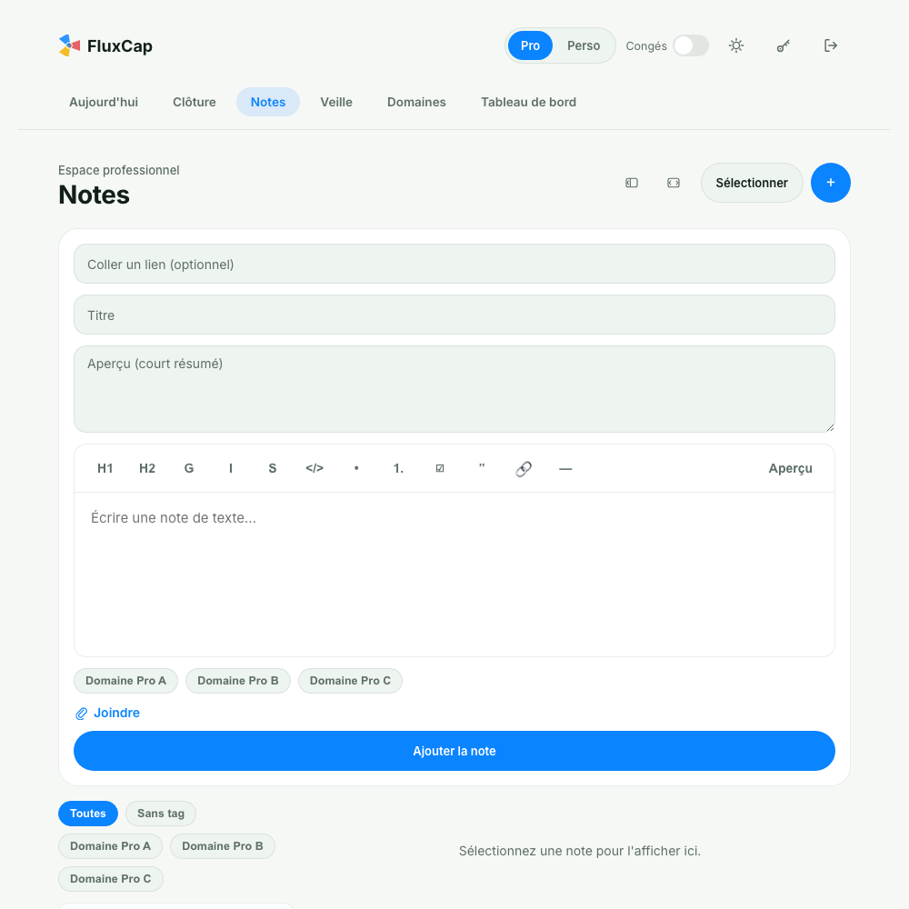</p>

<p><b>Ajout d'une source de veille</b><br/>
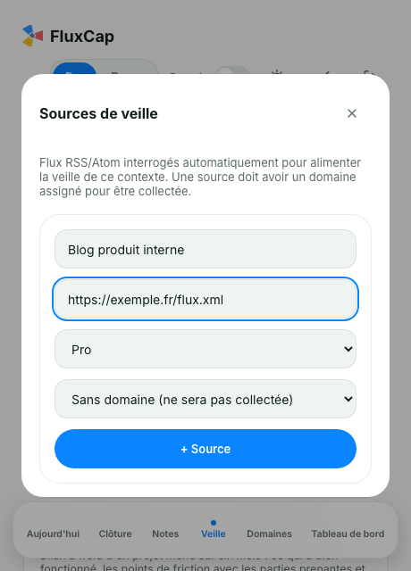</p>

<p><b>Mode "Congés"</b><br/>
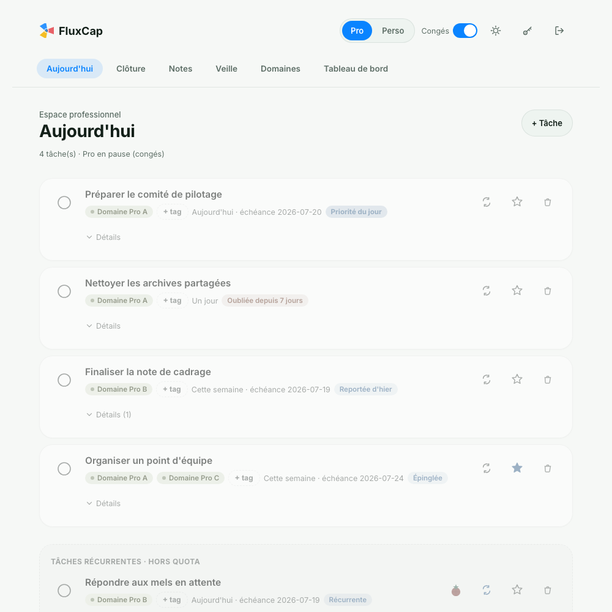</p>

<p><b>Pomodoro</b><br/>
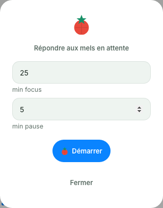
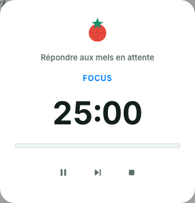</p>

## État actuel

POC fonctionnel (logique + écrans), déployé, protégé par authentification (mot de passe + WebAuthn/Face ID/Touch ID). Veille alimentée automatiquement (flux RSS/Atom) et notifications email d'ouverture/clôture, déclenchées par un workflow GitHub Actions planifié. Données factices uniquement en développement local — la base de production est vide par défaut.

## Structure

- `backend/` — API FastAPI, SQLite en local / Postgres en production
- `frontend/` — PWA React (Vite)

## Déploiement

- **Frontend** : [Vercel](https://vercel.com), racine du projet `frontend/`, build Vite standard.
- **Backend** : [Render](https://render.com), plan gratuit, déployé via le Blueprint [`render.yaml`](./render.yaml) à la racine du repo.
- **Base de données** : Postgres géré par [Supabase](https://supabase.com) (le plan gratuit de Render n'a pas de disque persistant).
- **Pièces jointes** : bucket [Supabase Storage](https://supabase.com) (même raison — voir `backend/app/services/stockage.py`, qui retombe sur le disque local si aucune variable Supabase n'est renseignée).

Toutes les variables d'environnement nécessaires (connexion Postgres, clés Supabase, origine CORS, clé de signature des sessions, config WebAuthn) sont listées dans [`.env.example`](./.env.example) et dans `render.yaml`. Aucune valeur réelle n'est commitée ; elles sont saisies directement dans les tableaux de bord Render/Vercel.

Le plan gratuit de Render met le service en veille après ~15 min d'inactivité (cold start lent au réveil) — une 10e tâche cron-job.org (GET `/health` toutes les 5 minutes, pas d'authentification requise) l'évite. Auparavant sur UptimeRobot, consolidée sur cron-job.org le 2026-07-23 en même temps que la planification veille/notifications (voir "Horaires de notification" ci-dessous) — un seul service à gérer plutôt que deux, un cron GitHub Actions ayant déjà été écarté avant ça pour ce même besoin (peu fiable sur des intervalles courts, retards observés de 60-95 min).

### Migrations de schéma

Pas d'Alembic ni d'outil de migration : `Base.metadata.create_all()` (appelé au démarrage du backend) ne crée que les tables **manquantes**, jamais les colonnes ajoutées à une table qui existe déjà en prod. Tout changement de schéma sur une table existante nécessite donc un `ALTER TABLE` (ou `CREATE TABLE`, `INSERT` de backfill...) manuel, à exécuter dans le SQL Editor de Supabase.

Ordre à respecter pour un changement qui ajoute des tables/colonnes dont le nouveau code a besoin pour fonctionner :
1. Exécuter le SQL de migration dans Supabase (création de tables, backfill des données existantes) **avant** de pousser le code qui en dépend — sinon, entre le déploiement et la migration, le nouveau code lirait des tables/colonnes vides ou absentes.
2. Pousser le code, laisser Render redéployer.
3. Une fois le bon fonctionnement confirmé en prod, exécuter en dernier le nettoyage des anciennes colonnes/tables devenues inutiles (`DROP COLUMN`...) — cette étape n'est jamais urgente puisque le nouveau code ne les lit plus.

Toute nouvelle table doit avoir Row Level Security (RLS) activé, sinon elle reste exposée en lecture/écriture à quiconque connaît l'URL du projet via l'API REST publique que Supabase génère automatiquement (PostgREST) — indépendamment du fait que le backend ne l'utilise jamais (il se connecte en direct Postgres avec le rôle `postgres`, qui bypass RLS par défaut, donc l'activer ne casse rien côté app et ne nécessite aucune policy) :
```sql
ALTER TABLE public.<nom_de_la_table> ENABLE ROW LEVEL SECURITY;
```
(Si l'éditeur SQL de Supabase propose "Run without RLS" lors d'une création de table, ne pas accepter — exécuter la commande ci-dessus juste après la création.)

### Horaires de notification

Les horaires d'ouverture/clôture Pro/Perso (et de collecte de veille) sont planifiés par **9 tâches sur [cron-job.org](https://cron-job.org)** (compte gratuit), pas par du code ni un fichier versionné — chaque tâche fait un `POST` vers un endpoint `/planification/...` du backend avec l'en-tête `X-Scheduler-Secret` (même valeur que la variable d'env `SCHEDULER_SECRET` sur Render), en fuseau **Europe/Paris** (cron-job.org gère nativement le passage heure d'été/hiver, pas de dérive à corriger contrairement à un cron en UTC).

| Tâche | Endpoint | Horaire (Paris) | Jours |
|---|---|---|---|
| Veille Pro | `/planification/veille/pro` | 06:00 | Lun-Ven |
| Veille Perso | `/planification/veille/perso` | 20:00 | Tous les jours |
| Notif Pro ouverture | `/planification/notification/pro/ouverture` | 07:30 | Lun-Ven |
| Notif Pro clôture | `/planification/notification/pro/cloture` | 17:30 | Lun-Jeu |
| Notif Pro clôture vendredi | `/planification/notification/pro/cloture` | 13:00 | Ven |
| Notif Perso ouverture semaine | `/planification/notification/perso/ouverture?creneau=semaine` | 21:00 | Tous les jours |
| Notif Perso clôture weekend | `/planification/notification/perso/cloture?creneau=weekend` | 21:01 | Tous les jours |
| Notif Perso clôture semaine | `/planification/notification/perso/cloture?creneau=semaine` | 07:00 | Tous les jours |
| Notif Perso ouverture weekend | `/planification/notification/perso/ouverture?creneau=weekend` | 09:00 | Tous les jours |

Points à garder en tête :
- Pour Perso, qui a deux rythmes selon le jour (semaine 21h/7h, week-end 9h/21h — voir `app/services/notification_email.py::_bon_creneau`), c'est le backend qui décide du bon rythme à appliquer, pas le planificateur : les deux créneaux sont déclenchés tous les jours, un seul aboutit réellement selon le vrai jour de la semaine (et le mode congés). Pro n'a pas cette logique de créneau — chaque appel envoie simplement le récap de ce qui est en attente au moment de l'appel, donc changer son horaire (y compris juste pour un jour) ne touche qu'à la tâche cron-job.org concernée, jamais au code backend.
- **Historique** : ces 9 tâches remplacent depuis le 2026-07-23 les `schedule:` cron de [`.github/workflows/planification.yml`](./.github/workflows/planification.yml), abandonnés pour cause de fiabilité — GitHub Actions retardait ces envois de façon très importante et systématique (jusqu'à 5h40 de retard observé, confirmé par l'historique d'envoi Resend), pas juste de la congestion occasionnelle. Le workflow GitHub garde uniquement un déclenchement manuel (`workflow_dispatch`, menu **Actions → Planification veille et notifications → Run workflow**), pratique pour tester un endpoint sans attendre l'heure réelle.
- Pour changer un horaire : modifier directement la tâche correspondante sur cron-job.org (pas de redéploiement Render nécessaire, effectif au prochain déclenchement).
- Le même compte cron-job.org porte aussi une 10e tâche, sans rapport avec les notifications : un ping anti-cold-start (`GET /health` toutes les 5 minutes, sans authentification) qui évite la mise en veille du plan gratuit Render — voir section "Déploiement" ci-dessus.

### Alternative : serveur unique auto-hébergé

Le déploiement actuel (Vercel + Render + Supabase + GitHub Actions) répartit l'app sur quatre plans gratuits. Rien n'empêche de tout consolider sur un seul serveur si on préfère gérer une seule machine plutôt que quatre tableaux de bord — voici ce qu'il faudrait, dans l'ordre où ça devient bloquant :

- **Base de données** : Postgres auto-hébergé (ou SQLite pour un usage strictement mono-utilisateur, mais Postgres colle mieux à ce qui a déjà été testé — enums natifs, contrainte d'unicité sur `selection_jour`). Un conteneur Postgres standard suffit, sans équivalent du dashboard Supabase.
- **Pièces jointes** : rien à faire — `backend/app/services/stockage.py` retombe déjà sur le disque local dès qu'aucune variable Supabase n'est renseignée. Il suffit de monter un volume persistant pour ce répertoire.
- **Frontend** : servir le build statique (`npm run build`, dossier `frontend/dist`) directement via un reverse proxy devant FastAPI, plutôt que Vercel.
- **Reverse proxy + TLS** : un point qui n'existe pas aujourd'hui (Vercel/Render gèrent ça pour nous) — [Caddy](https://caddyserver.com) est le plus simple pour avoir du HTTPS automatique (obligatoire pour l'installation PWA) sans certificat à renouveler à la main.
- **Tâches planifiées** : remplacer les 9 tâches cron-job.org par un cron système ou un scheduler in-process (ex. APScheduler) qui appelle les mêmes endpoints `/planification/...` — mais rien d'urgent ici, cron-job.org fonctionne bien et reste externe au serveur applicatif.
- **Email (Resend)** resterait externe — auto-héberger l'envoi d'emails n'a pas de sens pour ce volume d'usage.
- **Ping anti-veille (10e tâche cron-job.org)** deviendrait inutile : c'est spécifiquement un contournement du cold start du plan gratuit Render, qui ne concerne pas un serveur toujours allumé.

Le vrai compromis n'est pas technique mais opérationnel : ce changement fait passer d'une architecture zéro-ops (mais éclatée) à un seul serveur plus simple à raisonner, en échange de la responsabilité — jusqu'ici gratuite et automatique — des sauvegardes, des correctifs de sécurité et de la disponibilité. Docker Compose (backend + Postgres + Caddy) serait l'assemblage le plus simple à maintenir si ce chemin est un jour suivi.

## Démarrage local

### Backend

```bash
cd backend
python3 -m venv .venv && source .venv/bin/activate
pip install -r requirements.txt
python -m app.seed   # peuple la base avec des données factices
uvicorn app.main:app --reload
```

### Frontend

```bash
cd frontend
npm install
npm run dev
```

## Configuration

Copier `.env.example` vers `.env` et adapter les valeurs. Le fichier `.env` n'est jamais commité.

## Licence

Bertrand Formet, codéveloppé avec Claude Code. Ce projet est distribué sous licence [Creative Commons BY 4.0](./LICENSE).
